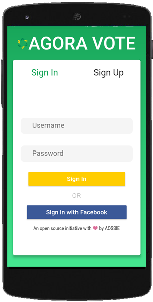

# AGORA Mobile

A Flutter Application/mobile client that describes the functionality of the AGORA Vote Web - API

## Screenshots

- Sign-in / Sign-up

    

- Dashboard

    

- Creating an Election 

    
    
    
    
    

For help getting started with Flutter, view our 
[online documentation](https://flutter.io/docs), which offers tutorials, 
samples, guidance on mobile development, and a full API reference.
